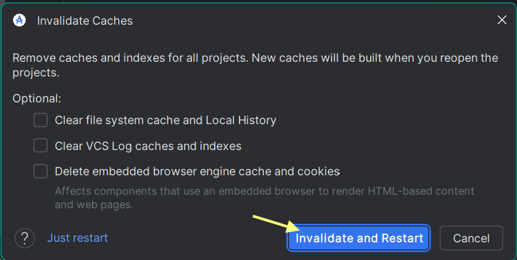

# Development Notes and Documentation

## When the project is not recognizing layout files or other package resources

*If at any point the issue is resolved, there is no need to continue to the next step.*

### Step 1: Verify references

1. Double check that there are no typos in the references.
2. Ensure that the referenced layouts are located in the `res/layout` directory.
   <br><br />

> ⚠️ ***NOTE**: Steps 2-4 can take upwards of 20 minutes (each) to complete depending on the project size and system. This is normal and will require patience.*

### Step 2: Rebuild the project

Using the hammer icon (shown below) on at the top of the console, build the project.


### Step 3:  Clean Project and Rebuild

Clean the project : *This deletes the build directory and therefore all compiled files*

```
Build -> Clean Project
```

Once fully processed, rebuild the project:
```
Build -> Rebuild Project
```

### Step 4: Clear the Cache and Restart the IDE

If all else fails, clear the cache:
```
File -> Invalidate Caches
```

In the pop up menu, select Invalidate and Restart:


*Note: Do not check any of the optional boxes*
